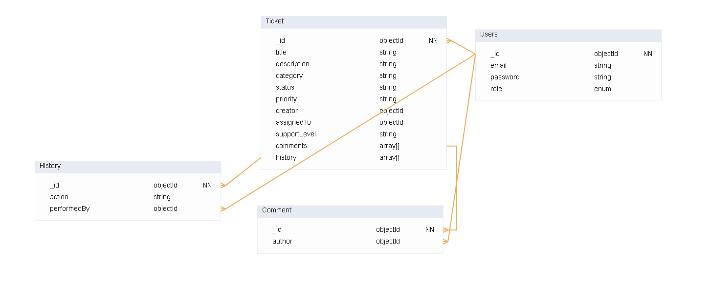
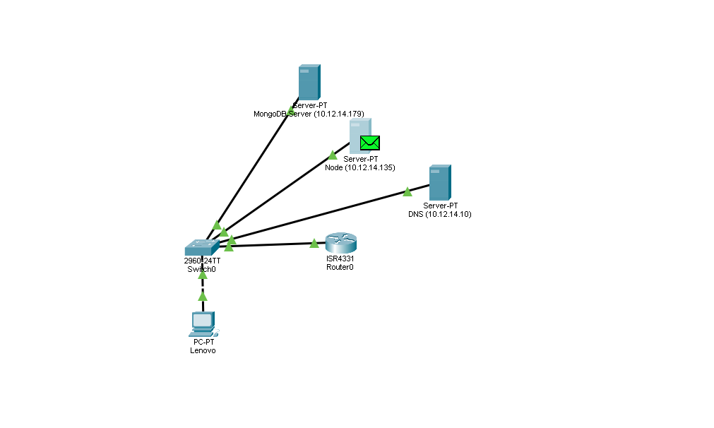

# Helpdesk System

Dette prosjektet er et helpdesk-system inspirert av Spiceworks, utviklet for å håndtere brukerstøtte, feilmeldinger og teknisk administrasjon. Systemet gir brukere mulighet til å sende inn henvendelser (tickets), mens administratorer kan følge opp, svare og lukke saker.

## Funksjonalitet
- **Autentisering og roller**:
  - Innlogging for brukere og administratorer.
  - Registrering av nye brukere.
  - Roller: bruker og admin.
- **Ticketsystem**:
  - Opprettelse av support-henvendelser (tickets).
  - Mulighet for å legge inn beskrivelse og kategori.
  - Brukere kan se egne henvendelser og svar.
  - Administratorer kan se alle henvendelser.
- **Statushåndtering**:
  - Administratorer kan endre status på tickets: "Åpen", "Under arbeid", "Løst".
  - Administratorer kan endre prioritet på tickets.
  - Brukere kan følge med på statusen til sine egne tickets.
- **Frontend**:
  - Brukervennlig og responsivt design.
  - Eget dashbord for brukere og administratorer.
- **Backend**:
  - Node.js/Express API med RESTful endepunkter.
  - MVC-struktur for god kodeorganisering.
  - Sikkerhet: hashing av passord, JWT, httpOnly-cookies og rutebegrensning.
- **Bonus**:
  - Kommentarsystem for dialog mellom bruker og admin.
  - Historikk for oppdateringer i hver sak.

---

## Teknologier
- **Frontend**: EJS, Bootstrap.
- **Backend**: Node.js, Express.
- **Database**: MongoDB.
- **Autentisering**: JWT (JSON Web Tokens).
- **Sikkerhet**: Hashing av passord (bcrypt), httpOnly-cookies.

---

## Endepunkter

### **Autentisering**
| Metode | Endepunkt       | Beskrivelse                          |
|--------|-----------------|--------------------------------------|
| GET    | `/login`        | Viser innloggingssiden.             |
| POST   | `/login`        | Logger inn brukeren.                |
| GET    | `/register`     | Viser registreringssiden.           |
| POST   | `/register`     | Registrerer en ny bruker.           |
| GET    | `/logout`       | Logger ut brukeren.                 |

---

### **Ticketsystem**
| Metode | Endepunkt                  | Beskrivelse                                      |
|--------|----------------------------|--------------------------------------------------|
| GET    | `/tickets`                 | Viser alle tickets for brukeren.                |
| GET    | `/tickets/create`          | Viser skjema for å opprette en ny ticket.       |
| POST   | `/tickets/create`          | Oppretter en ny ticket.                         |
| GET    | `/tickets/:id`             | Viser detaljer for en spesifikk ticket.         |
| POST   | `/tickets/:id/comments`    | Legger til en kommentar på en ticket.           |
| POST   | `/tickets/:id/resolve`     | Marker en ticket som løst.                      |

---

### **Admin-funksjoner**
| Metode | Endepunkt                  | Beskrivelse                                      |
|--------|----------------------------|--------------------------------------------------|
| GET    | `/dashboard`               | Viser admin-dashbordet med oversikt over tickets.|
| POST   | `/tickets/:id/status`      | Oppdaterer status på en ticket.                 |
| POST   | `/tickets/:id/priority`    | Oppdaterer prioritet på en ticket.              |

---

## Filstruktur
```
├── controllers
│   ├── authController.js       # Håndterer autentisering.
│   ├── dashboardController.js  # Håndterer admin-dashbordet.
│   ├── ticketController.js     # Håndterer tickets.
│   └── databaseController.js   # Kobler til MongoDB.
├── models
│   ├── userModel.js            # Brukermodell.
│   └── ticketModel.js          # Ticketmodell.
├── routes
│   ├── authRoutes.js           # Ruter for autentisering.
│   ├── dashboardRoutes.js      # Ruter for admin-dashbordet.
│   └── ticketRoutes.js         # Ruter for tickets.
├── views
│   ├── auth                   # EJS-filer for innlogging og registrering.
│   ├── dashboard              # EJS-filer for admin-dashbordet.
│   ├── tickets                # EJS-filer for tickets.
│   └── layouts                # Layout-filer.
├── public
│   ├── css                    # CSS-filer.
│   ├── js                     # JavaScript-filer.
├── utils
│   └── seedData.js            # Script for å opprette en admin-bruker.
├── .env                        # Miljøvariabler.
├── .gitignore                  # Ignorerte filer.
├── index.js                    # Hovedfil for serveren.
├── package.json                # Avhengigheter og scripts.
```

---

## Oppsett

### 1. Installer avhengigheter
```bash
npm install
```

### 2. Konfigurer miljøvariabler
Opprett en `.env`-fil med følgende innhold:
```
MONGODB_URI=<din-mongodb-uri>
JWT_SECRET=<din-jwt-secret>
```

### 3. Start serveren
```bash
npm start
```

### 4. Seed admin-bruker (valgfritt)
Fjern kommentaren fra `seedData.seedAdmin()` i `index.js` for å opprette en admin-bruker:
```javascript
seedData.seedAdmin();
```
Standard admin-bruker:
- **E-post**: `admin@helpdesk.com`
- **Passord**: `Admin123!`

---

## Sikkerhet
- **Passord**: Hashes med bcrypt før lagring.
- **Autentisering**: JWT med httpOnly-cookies.
- **Rutebegrensning**: Middleware for å beskytte admin-ruter.
- **Validering**: Skjemaer valideres før innsending.

---

## Bonusfunksjoner
- **Kommentarsystem**: Brukere og administratorer kan legge til kommentarer på tickets.
- **Historikk**: Oversikt over alle oppdateringer på en ticket.

## ER-Diagram

Følgende diagram viser relasjonene mellom entitetene i databasen:



### Relasjoner:
1. **Bruker ↔ Ticket**:
   - En `Bruker` kan opprette flere `Tickets` (en-til-mange-relasjon).
   - Feltet `creator` i `Ticket`-modellen refererer til `_id` i `User`-modellen.

2. **Ticket ↔ Kommentar**:
   - En `Ticket` kan ha flere `Kommentarer` (en-til-mange-relasjon).
   - Feltet `ticket` i `Comment`-modellen refererer til `_id` i `Ticket`-modellen.

3. **Bruker ↔ Kommentar**:
   - En `Kommentar` er skrevet av en `Bruker` (mange-til-en-relasjon).
   - Feltet `author` i `Comment`-modellen refererer til `_id` i `User`-modellen.

4. **Ticket ↔ Historikk**:
   - En `Ticket` kan ha flere `Historikk`-oppføringer (en-til-mange-relasjon).
   - Feltet `ticket` i `History`-modellen refererer til `_id` i `Ticket`-modellen.

5. **Bruker ↔ Historikk**:
   - En `Historikk`-oppføring er utført av en `Bruker` (mange-til-en-relasjon).
   - Feltet `performedBy` i `History`-modellen refererer til `_id` i `User`-modellen.

## Nettverksoppsett



Dette prosjektet er satt opp i et nettverk med følgende noder:

- **Node.js-applikasjon**: Kjøres på en virtuell maskin med IP-adressen og bruker nginx som reversproxy `10.12.14.135`.
- **DNS-server**: Håndterer domenenavn. Bruker bind9 og kjører på IP-adressen `10.12.14.10`.
- **MongoDB-database**: Kjøres på en virtuell maskin med IP-adressen `10.12.14.179`.

Nettverket er designet for å sikre effektiv kommunikasjon mellom applikasjonen, DNS-serveren og databasen, samtidig som det opprettholder høy sikkerhet og ytelse.

# BASH SCRIPT
## Server Oppsett (Ubuntu 22.04)

### 1. Koble til Ubuntu-serveren
```bash
ssh brukernavn@server-ip
```

### 2. Last ned setup-scriptet
```bash
# Opprett en midlertidig mappe
mkdir ~/temp og cd ~/temp

# Last ned setup-scriptet
wget https://raw.githubusercontent.com/simontijanic/vg2-helpdesk-prosjekt-frontend/main/setup-server.sh

# Gi scriptet kjøretillatelse
chmod +x setup-server.sh
```

### 3. Kjør setup-scriptet
```bash
# Kjør scriptet
bash setup-server.sh
# Eller
./setup-server.sh
```

### 4. Verifiser installasjonen
Etter at scriptet er ferdig, sjekk at tjenesten kjører:
```bash
# Sjekk PM2 status
pm2 status

# Sjekk applikasjonslogger
pm2 logs helpdesk

# Sjekk at applikasjonen er tilgjengelig
curl http://ipadresse:3000
```

### 5. Vanlige PM2 kommandoer
```bash
# Start applikasjonen
pm2 start helpdesk

# Restart applikasjonen
pm2 restart helpdesk

# Stopp applikasjonen
pm2 stop helpdesk

# Se logger
pm2 logs helpdesk

# Monitor ressursbruk
pm2 monit
```

### Feilsøking

#### PM2 ikke funnet
Hvis `pm2` kommandoen ikke blir funnet, kjør:
```bash
source ~/.bashrc
# eller
export PATH="$HOME/.nvm/versions/node/$(node -v)/bin:$PATH"
```

#### Problemer med tilgang
Hvis du får tilgangsfeil:
```bash
# Sjekk eierskap på applikasjonsmappen
ls -l /var/www/helpdesk

# Fix tilganger om nødvendig
sudo chown -R $USER:$USER /var/www/helpdesk
sudo chmod -R 755 /var/www/helpdesk
```

#### MongoDB tilkobling
Hvis MongoDB ikke er tilgjengelig:
```bash
# Sjekk MongoDB status
sudo systemctl status mongodb

# Start MongoDB om nødvendig
sudo systemctl start mongodb
```

### Firewall Configuration (UFW)

#### Application Server
```bash
# Install UFW
sudo apt install ufw

# Set default policies
sudo ufw default deny incoming
sudo ufw default allow outgoing

# Allow SSH (port 22)
sudo ufw allow ssh

# Allow HTTP (port 80)
sudo ufw allow http

# Allow HTTPS (port 443)
sudo ufw allow https

# Enable UFW
sudo ufw enable

# Check status
sudo ufw status
```

#### Database Server
```bash
# Install UFW
sudo apt install ufw

# Set default policies
sudo ufw default deny incoming
sudo ufw default allow outgoing

# Allow SSH (port 22)
sudo ufw allow ssh

# Allow MongoDB from Application Server only
sudo ufw allow from <app-server-ip> to any port 27017

# Enable UFW
sudo ufw enable

# Check status
sudo ufw status
```

### MongoDB Security Configuration

1. **Enable Authentication**:
   Edit `/etc/mongod.conf`:
   ```yaml
   security:
     authorization: enabled
   ```

2. **Network Configuration**:
   ```yaml
   net:
     port: 27017
     bindIp: 127.0.0.1,<mongodb-server-ip>
   ```

6. **Restart MongoDB**:
   ```bash
   sudo systemctl restart mongod
   ```

7. **Verify Configuration**:
   ```bash
   # Check MongoDB status
   sudo systemctl status mongod
   
   # Check logs for errors
   sudo tail -f /var/log/mongodb/mongod.log
   ```


## Sikkerhetsoppsett

### 1. SSH Match Blocks
SSH-konfigurasjonen bruker **Match Blocks** for å spesifisere regler for ulike brukere og grupper. Dette er definert i `setup-server.sh`-scriptet:

- **Global SSH-innstillinger**:
  - `PermitRootLogin no`: Root-innlogging er deaktivert.
  - `MaxAuthTries 3`: Maksimalt 3 forsøk på autentisering før tilkoblingen avsluttes.
  - `ClientAliveInterval 300`: Serveren sender en "keep-alive"-melding hvert 300. sekund.
  - `ClientAliveCountMax 2`: Tilkoblingen avsluttes etter 2 manglende svar.

- **Match Blocks**:
  - **Utviklere**:
    ```
    Match User dev
        AllowTcpForwarding yes
        X11Forwarding yes
        PasswordAuthentication no
        PermitTTY yes
        MaxSessions 10
        AllowAgentForwarding yes
        PermitTunnel yes
    ```
    - Tillater TCP-forwarding, X11-forwarding og agent-forwarding.
    - Maksimalt 10 samtidige sesjoner.

  - **Administratorer (geir, monica)**:
    ```
    Match User geir,monica
        AllowTcpForwarding yes
        X11Forwarding no
        PasswordAuthentication no
        PermitTTY yes
        MaxSessions 3
    ```
    - Tillater TCP-forwarding, men ikke X11-forwarding.
    - Maksimalt 3 samtidige sesjoner.

  - **Andre brukere**:
    ```
    Match Group users
        AllowTcpForwarding no
        X11Forwarding no
        PasswordAuthentication no
        PermitTTY yes
        MaxSessions 2
    ```
    - Ingen forwarding tillatt.
    - Maksimalt 2 samtidige sesjoner.

  - **Internt nettverk**:
    ```
    Match Address 10.0.0.0/8
        MaxSessions 5
    ```
    - Maksimalt 5 samtidige sesjoner for tilkoblinger fra det interne nettverket.


### 3. IP-binding til MongoDB
MongoDB er konfigurert til å kun lytte på spesifikke IP-adresser for økt sikkerhet. Dette er definert i `setup-server.sh` og MongoDB-konfigurasjonsfilen (`/etc/mongod.conf`):

- **Konfigurasjon**:
  ```yaml
  net:
    port: 27017
    bindIp: 127.0.0.1,<mongodb-server-ip>
  ```
  - `127.0.0.1`: Tillater kun lokale tilkoblinger.
  - `<mongodb-server-ip>`: Tillater tilkoblinger fra applikasjonsserverens IP.

- **Aktivering**:
  Etter å ha oppdatert konfigurasjonsfilen, må MongoDB startes på nytt:
  ```bash
  sudo systemctl restart mongod
  ```

Disse sikkerhetsmekanismene sikrer at serveren og databasen er beskyttet mot uautoriserte tilkoblinger.

### UFW-regler for servere

#### Node.js-applikasjonsserver
- **Standardpolicyer**:
  - `sudo ufw default deny incoming`: Blokkerer alle innkommende tilkoblinger som standard.
  - `sudo ufw default allow outgoing`: Tillater alle utgående tilkoblinger som standard.

- **Tillatte porter**:
  - `sudo ufw allow ssh`: Tillater SSH-tilkoblinger (port 22).
  - `sudo ufw allow http`: Tillater HTTP-trafikk (port 80).
  - `sudo ufw allow https`: Tillater HTTPS-trafikk (port 443).

- **Aktivering**:
  - `sudo ufw enable`: Aktiverer brannmuren.

#### MongoDB-databaseserver
- **Standardpolicyer**:
  - `sudo ufw default deny incoming`: Blokkerer alle innkommende tilkoblinger som standard.
  - `sudo ufw default allow outgoing`: Tillater alle utgående tilkoblinger som standard.

- **Tillatte porter**:
  - `sudo ufw allow ssh`: Tillater SSH-tilkoblinger (port 22).
  - `sudo ufw allow from 10.12.14.135 to any port 27017`: Tillater MongoDB-tilkoblinger kun fra Node.js-applikasjonsserverens IP.

- **Aktivering**:
  - `sudo ufw enable`: Aktiverer brannmuren.

  Dette er dokumentasjonen for prosjektet